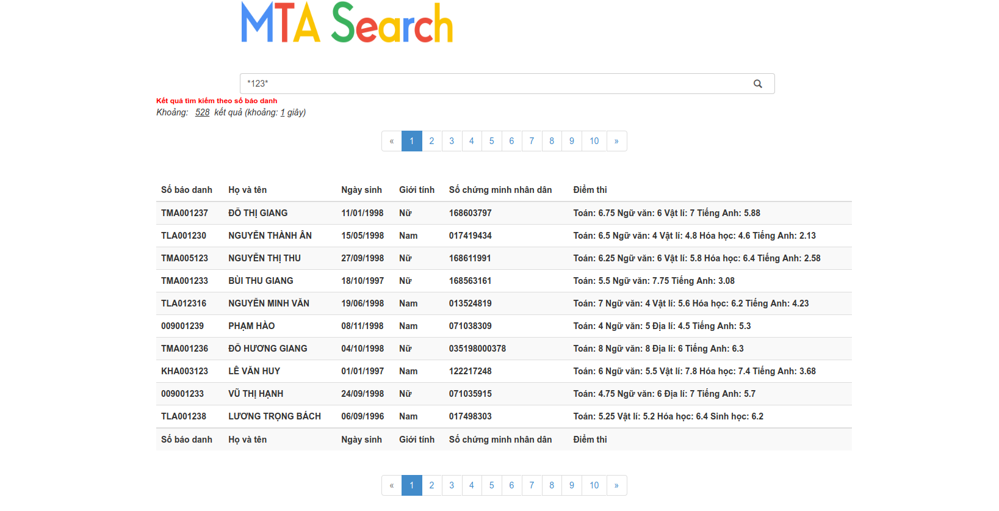

## Sử dụng solr để index và tìm kiếm dữ liệu lớn

### 1. Cài đặt
Hãy chắc chắn rằng bạn đã cài đặt và khởi chạy solr

Bạn đã cài đặt Laravel trên máy tính

```bash
git clone https://github.com/phuctu1901/solr-search
cd solr-search
composer install
php artisan key:generate
php artisan serve --host <your custom host> --p <your custom port>
```

Để thuận tiện trong quá trình kiểm thử có thể sử dụng `ngrok` để public địa chỉ ra internet
```bash
ngrok http http://<your_ip_laravel_running>:<port>

```

### 2. Hướng dẫn sử dụng:
Website sử dụng bằng cách tìm theo số báo danh (mặc dù dữ liệu được index là nhiều trường khác nữa, tuy nhiên để dễ dàng hơn trong quá trình làm web thì chỉ triển khai như thế này)

Các thức nhập từ khóa tương tự như khi dùng `Solr`:
```markdown
1. *từ khóa*: tìm kết quả có giá trị ở giữa bằng từ khóa
2. *từ khóa: tìm kết quả có kết thúc giông từ khóa
3. từ khóa*: tìm kết quả có bắt đầu giống từ khóa
...
```

### 3. Ảnh chụp màn hình:


Hình 1: Trang chủ



Hình 2: Kết quả tìm 

## 4. License      
[MIT](./LICENSE)
